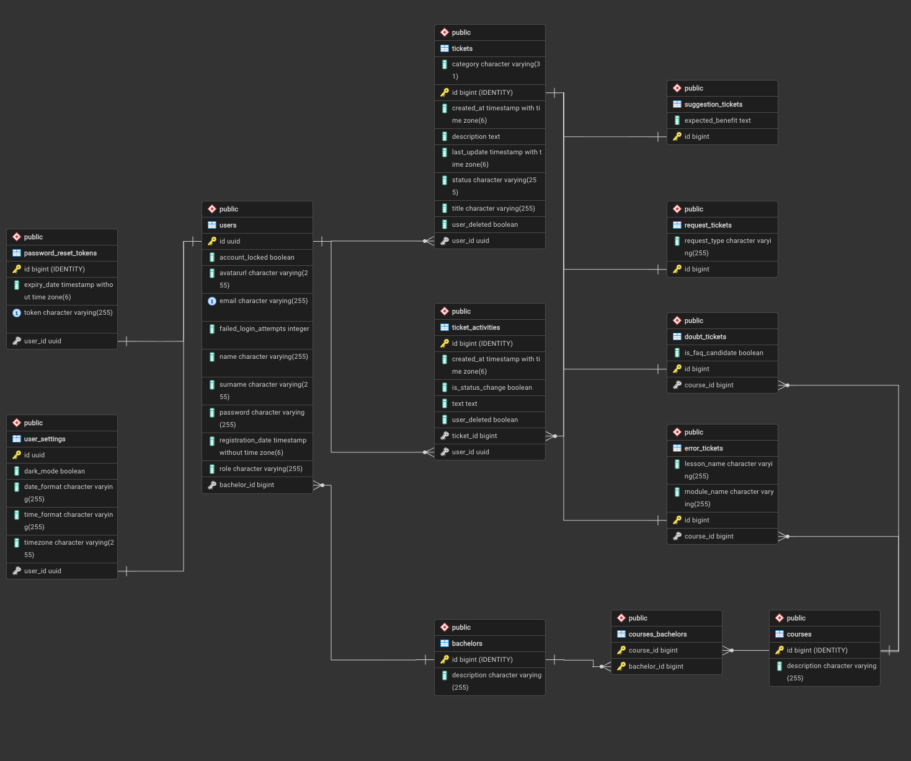

# Epicode Ticketing — Backend

> [!NOTE]
> **Academic Project**: Developed as the final project for the **Backend Programming** course at **EPICODE Institute of Technology**.
>
> This repository contains the source code and documentation required for the examination.
>
> 📄 **Official Requirements**: [Download Project Specifications (PDF)](docs/requirements.pdf)

---

## Related Repository

| Part | Repository |
|---|---|
| Frontend (React) | [epicode-ticketing-frontend](https://github.com/jessegaletta/epicode-ticketing-frontend) |

---

## Overview

**Epicode Ticketing** is a RESTful backend for a real-world support ticketing system. Born from a concrete need — as student representative at **EPICODE Institute of Technology**, I needed a structured way to collect and manage requests from fellow students. Students can submit tickets for doubts, errors, requests, or suggestions; faculty and administrators manage and respond to them through a structured activity log.

The application runs on port `3001` by default.

---

## Requirements Coverage

| Requirement | Implementation |
|---|---|
| At least 8 tables with meaningful relationships | `users`, `tickets`, `error_tickets`, `doubt_tickets`, `suggestion_tickets`, `request_tickets`, `ticket_activities`, `bachelors`, `courses`, `courses_bachelors`, `user_settings`, `password_reset_tokens` |
| Inheritance structure | `Ticket` base class with `JOINED` inheritance → `ErrorTicket`, `DoubtTicket`, `SuggestionTicket`, `RequestTicket` |
| User management with profile image | Registration, login, avatar upload via Cloudinary, profile update |
| REST APIs with consistent error handling | Structured JSON error responses via global exception handler; Bean Validation on all incoming DTOs |
| JWT authentication + 3 roles | `STUDENT`, `FACULTY`, `ADMIN` — each with distinct permissions via `@PreAuthorize` |
| Filtering, sorting, pagination queries | Tickets and users support `page`, `size`, `sortBy`, `sortDir`, and `search` parameters |
| At least 2 third-party API integrations | Cloudinary (profile picture upload), Mailgun (transactional email) |

---

## Technologies

| Technology | Version |
|---|---|
| Java | 21 |
| Spring Boot | 4.0.5 |
| Spring Security + JWT (jjwt) | 0.13.0 |
| Spring Data JPA / Hibernate | — |
| PostgreSQL | — |
| Cloudinary SDK | 1.39.0 |
| Mailgun (via Unirest) | 4.8.1 |
| Bean Validation | — |

---

## Data Model



---

## Third-Party Integrations

- **Cloudinary** — used to upload and store user profile pictures. The returned `secure_url` is saved on the user entity.
- **Mailgun** — used to send a welcome email on registration and a password-reset link via the forgot-password flow.

---

## Setup and Running

### Prerequisites

| Requirement | Version |
|---|---|
| Java JDK | 21+ |
| Maven | 3.9+ |
| PostgreSQL | 14+ |

### Steps

1. Create a PostgreSQL database.
2. Create an `env.properties` file in the project root and fill in all values (see section below).
3. Run the application:

```bash
./mvnw spring-boot:run
```

The server starts on `http://localhost:3001`.

On first run, a default admin account is created automatically:

```
Email:    root@admin.com
Password: root
```

> Change these credentials immediately after the first login.

---

## Environment Variables

All variables are loaded from `env.properties` (excluded from version control). Create the file in the project root with the following structure:

```properties
PG_SERVER_NAME = localhost
PG_SERVER_PORT = 5432
PG_DB_NAME = your_database_name
PG_USERNAME = your_db_username
PG_PASSWORD = your_db_password

CLOUDINARY_CLOUD_NAME = your_cloud_name
CLOUDINARY_API_KEY = your_api_key
CLOUDINARY_SECRET = your_api_secret

MAILGUN_DOMAIN = your_mailgun_domain
MAILGUN_API_KEY = your_mailgun_api_key
MAILGUN_SENDER = no-reply@yourdomain.com

JWT_SECRET = your_long_random_secret_key
FRONTEND_URL = http://localhost:5173
```

---

## Postman Collection

> The Postman collection covering all implemented endpoints will be added to this repository soon.
